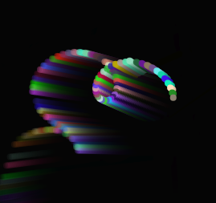

# SimpleParticle
Simple Particle 简单的粒子系统，支持 dom 或 canvas 模式

###options###
```html
mode: "dom",//dom || canvas
clearCanvas: true,//mode=canvas时，每次更新是否清除canvas
auto: true,//是否自动开始
createNew: function () {
    return true
},//是否创建新粒子
particlesNum: 10000,//最大粒子数
duration: 20,//画面更新频率
effectors: [],//自定义效果集合 function(...){this.apply = function(particle){}}}
particle: {
    position: null,//初始位置数组[x,y]，默认容器内随机位置,或指定随机范围如:[[100,200], [10,30]]，默认容器中央
    speed: [100, 100],//初始x,y速度大小数组[vx,vy],默认[100, 500]随机，或指定随机范围如:[[100,200], [10,30]]
    color: "random",//[R,G,B],初始颜色，默认随机，或指定随机范围如:[[0,0,1], [1,0,0]]，["white", "red"]
    angle: [0, Math.PI * 2],//初始x,y速度方向，范围0-2π,默认0-2π随机
    life: 2, //生命周期（秒），初始生命0
    size: 8,//初始大小
    node: "<div style='position:absolute;border-radius:4px;'></div>"//mode=dom有效
},
particles: null,//初始设置粒子Particle集合(不会创建新的粒子)，Particle = $(dom).simpleParticles("createParticle", particle's option)
updateProperty: [true, true],//是否按生命比率更新[颜色,大小]
gravity: [0, 100],//(x,y)重力
acceleration: [0, 100],//加速度，可变
initEmtr: null,//粒子发射源初始执行方法，可用于emtrTrail扩展参数。参数:（发射源Particle对象)
emtrTrail: null,//粒子发射源运动轨迹函数。参数:（发射源Particle对象)
onStart: null//粒子渲染前执行的函数。参数：（Particles粒子集合对象, 发射源Particle对象）
```
###method###
+ start/stop/pause/resume/toggle();

###snapshot###


###demo###
See [here](http://tt-cc.cn/front-end/jquery-plugins/particle)
